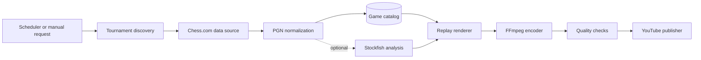

# Chess Replay

Chess Replay is a service for turning public Chess.com games into polished video replays that are ready to publish on YouTube. It is designed with recurring events such as **Titled Tuesday** in mind: discover a tournament, collect its games, render each game as an animated board, add useful context, and produce upload-ready video and metadata.

> [!IMPORTANT]
> The pipeline is runnable end to end: it discovers player tournaments, enriches profiles and scores through PubAPI, renders real-time evaluated replays and tournament compilations, encodes H.264/AAC video, and supports private-by-default YouTube uploads. Production scheduling and thumbnails remain in development.

## Goals

- Import public games from Chess.com tournaments, player archives, or individual game URLs.
- Support recurring tournament workflows without processing the same game twice.
- Replay legal moves on a clear, broadcast-friendly chessboard.
- Add player names, ratings, clocks, event details, results, and optional engine analysis.
- Render reproducible videos with FFmpeg and generate thumbnails and YouTube metadata.
- Run locally for development and as a scheduled, observable service in production.

## Non-goals

- Bypassing authentication, rate limits, access controls, or anti-bot protections.
- Republishing private games or content that is not available through an authorized source.
- Providing a real-time playing client or a general-purpose chess server.
- Automatically publishing videos without an explicit, configurable approval policy.

## Windows Setup

Windows is a supported development environment; WSL is not required. Install Python 3.13, FFmpeg, and Stockfish, then create an isolated virtual environment:

```powershell
winget install --exact --id Python.Python.3.13 --scope user
winget install --exact --id Gyan.FFmpeg --scope user
winget install --exact --id Stockfish.Stockfish --scope user
python -m venv .venv
.\.venv\Scripts\python.exe -m pip install -e ".[dev]"
Copy-Item .env.example .env
```

Set a real contact address in `CHESS_COM_USER_AGENT` before using PubAPI. A new terminal may be needed after `winget` updates `PATH`.

WSL is useful only if the eventual production target is Linux or the developer prefers Linux tooling. Do not share one `.venv` between Windows and WSL; create a separate environment inside each operating system.

## Dependencies

### Required system software

| Dependency | Minimum/expected version | Purpose |
| --- | --- | --- |
| Python | 3.11 or newer | Application runtime and virtual environments |
| FFmpeg and FFprobe | A build with `libx264` and AAC | H.264/AAC encoding, audio normalization, and media validation |
| Git | Any maintained version | Source control and deployment workflows |
| Stockfish | 17 or newer; 18 recommended | Position evaluation and evaluation bar |

### Optional system software

| Dependency | Platform | Purpose |
| --- | --- | --- |
| Windows PowerShell 5.1 and .NET `System.Speech` | Windows | Generic offline SAPI narration |
| `espeak-ng` | Linux/WSL | Generic offline Linux narration |

Install Ubuntu/WSL prerequisites:

```bash
sudo apt update
sudo apt install -y python3 python3-venv python3-pip ffmpeg stockfish espeak-ng fonts-dejavu-core git
python3 -m venv .venv
.venv/bin/python -m pip install -e '.[dev]'
```

Verify FFmpeg capabilities:

```bash
ffmpeg -hide_banner -encoders | grep libx264
ffmpeg -hide_banner -encoders | grep ' A.*aac'
```

### Direct Python dependencies

Installing `.[dev]` from [pyproject.toml](pyproject.toml) installs:

| Package | Purpose |
| --- | --- |
| `python-chess` | PGN parsing, legal moves, FEN, SAN, clocks, captures, checks, and mate detection |
| `Pillow` | Board frames, player panels, avatars, and thumbnails |
| `httpx` | Serial Chess.com PubAPI requests and conditional caching |
| `pydantic-settings` | Environment and `.env` configuration |
| `google-api-python-client` | YouTube Data API calls and resumable uploads |
| `google-auth-oauthlib` | YouTube installed-application OAuth flow |
| `pytest` | Test runner; development dependency |
| `pytest-cov` | Coverage reporting; development dependency |
| `ruff` | Linting; development dependency |

Transitive Python dependencies are resolved by pip and should not be installed individually. Run `python -m pip check` to verify the resulting environment.

### External accounts and files

- Chess.com PubAPI requires no API key, but `CHESS_COM_USER_AGENT` must identify the client and provide real contact information.
- YouTube upload requires a Google Cloud project, the YouTube Data API v3, an OAuth desktop-client JSON file, and a channel authorized during the consent flow.
- Dmitri narration requires a local clip pack supplied by the operator. Voice recordings are not downloaded, included, or licensed by this repository.

## Usage

### Quick Start

1. Copy the environment template and set a real contact address:

```powershell
Copy-Item .env.example .env
notepad .env
```

At minimum, replace the placeholder in `CHESS_COM_USER_AGENT`:

```text
CHESS_COM_USER_AGENT=chess-replay/0.1 (contact: you@example.com)
```

2. Verify the environment:

```powershell
.\.venv\Scripts\python.exe -m pip check
.\.venv\Scripts\python.exe -m pytest
.\.venv\Scripts\python.exe -m chess_replay ffmpeg-version
stockfish --help
```

3. Render the checked-in sample:

```powershell
.\.venv\Scripts\python.exe -m chess_replay render-pgn `
    samples\titled-tuesday-2026-08-11-round-9.pgn `
    --output output\sample.mp4 `
    --evaluation
```

The command writes `output\sample.mp4` and `output\sample.json`. The JSON manifest records source metadata, move timestamps, narrator, evaluation state, orientation, and render duration.

### Single Games

Inspect the checked-in Titled Tuesday game:

```powershell
.\.venv\Scripts\python.exe -m chess_replay inspect-pgn samples\titled-tuesday-2026-08-11-round-9.pgn
```

Render it to MP4:

```powershell
.\.venv\Scripts\python.exe -m chess_replay render-pgn samples\titled-tuesday-2026-08-11-round-9.pgn --output output\replay.mp4
```

Add a Stockfish evaluation bar to a single-game render:

```powershell
.\.venv\Scripts\python.exe -m chess_replay render-pgn samples\titled-tuesday-2026-08-11-round-9.pgn --output output\evaluated-replay.mp4 --evaluation
```

Enrich the video with public profile photos, real names, titles, round context, entering scores, score standing, move sounds, and automatic platform narration:

```powershell
.\.venv\Scripts\python.exe -m chess_replay render-pgn samples\titled-tuesday-2026-08-11-round-9.pgn --output output\enriched-replay.mp4 --enrich-pubapi --narrator auto
```

`--enrich-pubapi` requires a configured `CHESS_COM_USER_AGENT`. `--narrator auto` uses SAPI on Windows and `espeak-ng` on Linux. Use `--narrator off` to disable speech while retaining move sounds. The older `--commentary` flag remains as an alias for automatic narration.

Use a local Dmitri clip pack without committing its recordings:

```powershell
.\.venv\Scripts\python.exe -m chess_replay import-dmitlichess `
    --download `
    --target voice-packs\dmitri `
    --accept-private-use-only

.\.venv\Scripts\python.exe -m chess_replay render-pgn game.pgn --narrator dmitri --voice-pack-dir voice-packs\dmitri
```

The importer privately downloads the dmitlichess Chrome extension, safely extracts CRX2/CRX3 packages, preserves Dmitri's native move index, and writes a local manifest plus provenance. Dmitri mode uses exact SAN clips when available, the extension's generic capture fallback, and `fill` clips for uncovered moves. This provides one commentary clip per ply plus game-start and result clips.

The full pack currently contains about 2,040 unique Dmitri recordings. To create a much smaller category-only pack without per-move coverage, add `--semantic-only`. The downloaded extension, extracted recordings, generated pack, and rendered videos are excluded by `.gitignore`. They must not be force-added or redistributed.

To import an extension directory that is already installed or extracted:

```powershell
.\.venv\Scripts\python.exe -m chess_replay import-dmitlichess `
    --extension-dir C:\path\to\dmitlichess `
    --target voice-packs\dmitri `
    --clips-per-category 8 `
    --accept-private-use-only
```

The voice-pack directory must contain `manifest.json`, whose keys correspond to commentary kinds and whose values are filenames or filename lists:

```json
{
    "intro": ["intro-01.mp3"],
    "castle": ["castle-01.mp3"],
    "capture": ["capture-01.mp3", "capture-02.mp3"],
    "check": ["check-01.mp3"],
    "checkmate": ["mate-01.mp3"],
    "promotion": ["promotion-01.mp3"],
    "result": ["result-01.mp3"],
    "default": ["generic-01.mp3"]
}
```

FFmpeg normalizes selected clips to 44.1 kHz mono PCM before mixing. Only use recordings for which you have the necessary rights.

Fetch and catalog a player's monthly archive:

```powershell
.\.venv\Scripts\python.exe -m chess_replay fetch-player-month hikaru 2026 8
```

Render one player's complete tournament run as a single video:

```powershell
.\.venv\Scripts\python.exe -m chess_replay render-tournament `
    "Magnus Carlsen" `
    2026-08-18
```

Tournament compilations include a Stockfish evaluation bar by default. The followed player is always shown at the bottom, so the board and player panels flip whenever that player has Black. The default narrator remains `off`. Select another commentary mode when needed:

```powershell
# Generic platform voice: SAPI on Windows, espeak-ng on Linux
.\.venv\Scripts\python.exe -m chess_replay render-tournament `
    "Magnus Carlsen" 2026-08-18 --narrator auto

# Private local Dmitri clip pack
.\.venv\Scripts\python.exe -m chess_replay render-tournament `
    "Magnus Carlsen" 2026-08-18 `
    --narrator dmitri `
    --voice-pack-dir voice-packs\dmitri
```

The command performs the complete workflow:

1. Resolves the player to a canonical Chess.com profile.
2. Fetches the player's monthly archive once.
3. Finds the tournament matching the UTC date and `--tournament` name.
4. Maps games to Swiss rounds and reconstructs score progression.
5. Fetches opponent names, titles, and avatars with caching.
6. Renders every game in real time with the selected narrator.
7. Evaluates each unique position once with a shared Stockfish process and renders the evaluation bar.
8. Keeps the followed player at the bottom for both colors.
9. Inserts a result card after every game showing result, points, W-D-L record, round, and next opponent.
10. Concatenates all segments into one H.264/AAC MP4 and writes one JSON manifest.

Useful options:

```text
--tournament "Titled Tuesday"   Event-name filter; this is the default
--output output\run.mp4         Final output path
--transition-seconds 4          Result-card duration
--keep-intermediates            Preserve individual games and transition assets
--no-evaluation                 Disable Stockfish and the evaluation bar
```

Evaluation settings can be placed in `.env`:

```text
STOCKFISH_PATH=stockfish
EVALUATION_TIME_MS=200
EVALUATION_DEPTH=18
STOCKFISH_HASH_MB=256
STOCKFISH_THREADS=2
```

The default analysis budget is 200 ms per unique position at depth 18. The score is displayed from White's perspective (`+` favors White, `-` favors Black). The bar follows board orientation, eases to each new score over 0.4 seconds, and keeps the followed player's side at the bottom.

Replay headers place the event on one line and the game class, clock, and round on the next, such as `Blitz 3+1 · Round 4/11`. Result transitions explicitly identify the followed player's outcome, show both players' titles, and include the PubAPI termination reason, including checkmate, resignation, time out, stalemate, agreement, repetition, and insufficient material.

### Daily Non-Tournament Compilation

Render all of a player's non-tournament games from one UTC date:

```powershell
.\.venv\Scripts\python.exe -m chess_replay render-day `
    "Magnus Carlsen" `
    2026-08-17 `
    --output output\magnuscarlsen-2026-08-17-daily.mp4
```

Daily compilations use the same real-time clocks, exact move audio, Stockfish evaluation, profiles, flags, orientation, and H.264/AAC encoding as tournament compilations. Game headers show `Game N/total`, and each player panel shows that player's entering non-tournament day record as `Day 6W · 1D · 0L`. Result transitions show the explicit outcome and termination, both player titles, game format, cumulative followed-player W-D-L record, and next opponent.

By default, `render-day` excludes games associated with a tournament. Add `--include-tournament` to include every archived game on that UTC date. Other useful options are `--no-evaluation`, `--narrator`, `--transition-seconds`, and `--keep-intermediates`.

### YouTube Upload

Create a Google Cloud OAuth desktop client, enable YouTube Data API v3, and download its JSON credentials. Upload privately first:

```powershell
.\.venv\Scripts\python.exe -m chess_replay upload-youtube `
    output\run.mp4 `
    --title "Magnus Carlsen - Titled Tuesday" `
    --description "Source games: Chess.com" `
    --tag chess `
    --tag "Titled Tuesday" `
    --privacy private `
    --client-secrets client_secret.json `
    --token youtube_token.json
```

The first upload opens a browser for OAuth consent. Later uploads reuse `youtube_token.json`. Both credential filename patterns are ignored by Git.

### Output and Troubleshooting

- Generated videos and manifests are written under `output/` and ignored by Git.
- Use `--keep-frames` for a single game or `--keep-intermediates` for a tournament when diagnosing rendering.
- If PubAPI rejects a request, verify `CHESS_COM_USER_AGENT` and keep requests serial.
- If evaluation fails, run `Get-Command stockfish` and set `STOCKFISH_PATH` to the executable.
- If encoding fails, run `ffmpeg -hide_banner -encoders` and verify `libx264` and AAC are present.
- Encoded move attacks align to the exact visual frame timestamp. Tournament segments are decoded independently before concatenation so AAC priming cannot accumulate at game boundaries.
- Narration defaults to off. `--narrator auto` selects SAPI on Windows and `espeak-ng` on Linux.

Well-known names such as `Magnus Carlsen` and `Hikaru Nakamura` are supported directly. PubAPI does not provide a general real-name search endpoint, so use the Chess.com username (for example, `@magnuscarlsen`) when a display name cannot be resolved.

A player may withdraw or skip rounds. The compilation includes all games actually present in that player's archive and reports the real game count rather than assuming 11 games.

Run verification:

```powershell
.\.venv\Scripts\python.exe -m pytest
.\.venv\Scripts\python.exe -m ruff check src tests
.\.venv\Scripts\python.exe -m chess_replay ffmpeg-version
```

## How It Works



1. **Discover** an event and resolve its public identifier.
2. **Collect** games through Chess.com's supported public interfaces where possible.
3. **Normalize** PGN headers, moves, clocks, tournament metadata, and stable game IDs.
4. **Catalog** games and job state so retries are safe and duplicate videos are avoided.
5. **Enrich** games with optional Stockfish evaluations, opening names, and notable moments.
6. **Render** board frames, overlays, transitions, and audio into a deterministic timeline.
7. **Encode** the timeline as a YouTube-compatible video using FFmpeg.
8. **Validate and publish** the video, thumbnail, title, description, and attribution.

## Current Capabilities

### Game ingestion

- Chess.com player archive and tournament endpoint access
- Conditional response caching with `ETag` and `Last-Modified`
- Explicit handling for HTTP errors and `429 Too Many Requests`
- SQLite upserts based on stable Chess.com game IDs
- Tournament filtering through the source tournament URL
- Optional player profiles with public real name, title, avatar, FIDE rating, and country
- Swiss round reconstruction with each player's entering score and game number
- Score-only provisional standing labels

### Replay production

- Legal move and per-move clock parsing with `python-chess`
- Deterministic Pillow frames with shaped chess pieces and last-move highlights
- Public player photos, real names, titles, usernames, ratings, and clocks
- Tournament round, entering score, game number, and score-only standing overlays
- Original synthesized sounds for moves, captures, and checkmate
- Real-time pacing reconstructed from PGN clock annotations, including increments
- Active clock countdown while the board remains unchanged during thinking time
- Stockfish evaluation bar with cached unique-position analysis
- Captured-piece icons and standard point advantage beside each player
- Followed-player orientation with that player always at the bottom
- Selective factual commentary with Windows SAPI, Linux `espeak-ng`, or local clips
- Full player tournament compilations with between-game result and running-score cards
- Full daily non-tournament compilations with sequence and running W-D-L cards
- Configurable resolution, frame rate, pacing, and FFmpeg location
- H.264 MP4 encoding with YUV 4:2:0 output
- JSON render manifests alongside videos

Chess.com profile fields are optional. The renderer falls back to usernames and generated initials when a real name, title, or avatar is unavailable.

PubAPI round payloads expose games and participants, but their `points` values can reflect final totals even on earlier round URLs. Chess Replay therefore reconstructs entering scores from completed round results. The displayed standing is explicitly **by score**: exact Chess.com placement requires reproducing the event's Buchholz tiebreak calculations and handling withdrawals, byes, and fair-play adjustments.

### Publishing

- YouTube OAuth for installed applications
- Resumable video uploads with title, description, tags, and category
- Private upload visibility by default, with explicit unlisted/public options

## Project Structure

The implementation should keep data acquisition separate from rendering and publishing so each stage can be tested and rerun independently.

```text
chess_replay/
|-- src/
|   `-- chess_replay/
|       |-- ingestion/   # Chess.com PubAPI client
|       |-- chess/       # PGN parsing and replay states
|       |-- rendering/   # Pillow board frames and overlays
|       |-- media/       # FFmpeg encoding
|       |-- publishing/  # YouTube OAuth and resumable uploads
|       |-- jobs/        # Replay pipeline orchestration
|       `-- storage/     # SQLite game catalog
|-- samples/             # Reproducible PGN fixtures
|-- tests/
|-- output/              # Generated artifacts; excluded from source control
|-- .env.example
|-- pyproject.toml
`-- README.md
```

## Configuration

Secrets must be supplied outside source control. Runtime settings can be provided through environment variables or a local `.env` based on `.env.example`:

| Setting | Purpose | Required |
| --- | --- | --- |
| `CHESS_COM_USER_AGENT` | Identifies the client and provides contact information for responsible API usage | Yes |
| `FFMPEG_PATH` | Path to FFmpeg when it is not available on `PATH` | For rendering |
| `OUTPUT_DIRECTORY` | Destination for generated videos and metadata | No |
| `DATABASE_PATH` | SQLite game catalog path | No |
| `FRAME_WIDTH` / `FRAME_HEIGHT` | Output dimensions | No |
| `FRAME_RATE` | Encoded frames per second | No |
| `SECONDS_PER_POSITION` | Replay pacing for each board state | No |
| `STOCKFISH_PATH` | Stockfish executable or absolute path | For evaluation |
| `EVALUATION_TIME_MS` | Analysis time per unique position | No |
| `EVALUATION_DEPTH` | Maximum Stockfish depth per unique position | No |
| `STOCKFISH_HASH_MB` | Stockfish transposition-table memory | No |
| `STOCKFISH_THREADS` | Stockfish worker threads | No |
| `NARRATOR_MODE` | `off`, `auto`, `windows-sapi`, `espeak`, or `dmitri` | No |

YouTube publishing takes an OAuth desktop-client JSON file through `--client-secrets` and stores the resulting refreshable credentials at the `--token` path. Both credential patterns are ignored by Git.

## Responsible Data Use

Game data will be collected through Chess.com's free, read-only Published-Data API (PubAPI), not by scraping pages. PubAPI provides completed-game PGN, clock annotations, ratings, results, and source tournament and game URLs. The ingestion layer must:

- Respect the applicable Chess.com terms, robots guidance, API expectations, and rate limits.
- Use an informative `User-Agent` with a way to contact the operator.
- Cache responses and avoid repeatedly requesting unchanged archives or tournament data.
- Apply bounded concurrency and exponential backoff for transient failures.
- Preserve source links and attribution in generated video descriptions.
- Avoid downloading or publishing private or restricted data.

Player portraits are the public avatars returned by Chess.com's PubAPI and are cached locally. The renderer does not scrape profile pages or third-party portrait sites. Country codes also come from PubAPI; flag images are downloaded from [FlagCDN](https://flagcdn.com/), whose files are based on Wikimedia Commons flags. The standard Cburnett-style chess pieces are generated through `python-chess`. Chess.com piece art, sound files, and logos are not copied.

Before operating this service at scale, verify that the collection and publication workflow complies with Chess.com's current terms and YouTube's API Services Terms of Service. Game records may be public, but logos, broadcasts, commentary, music, fonts, and other presentation assets can have separate usage rights.

## Video Output

The current renderer produces an MP4 and JSON manifest:

```text
output/
|-- replay.mp4
`-- replay.json
```

The render manifest should record source identifiers, input hashes, renderer version, theme, engine settings, and encoding parameters. This makes a video reproducible and allows the service to determine whether an existing render can be reused.

Current output defaults:

- MP4 with H.264 video and AAC audio
- 1920x1080 resolution at 30 fps
- YUV 4:2:0 pixel format for broad playback compatibility
- Real game duration when every move has a clock annotation
- Whole-second clock display, with fractional timing retained internally
- Move/capture/mate attacks aligned to the first encoded frame showing each move
- 1.2-second fallback only for moves whose clock annotation is unavailable

## Commentary and Voice Rights

The browser extension associated with Andrew Tang's streams is **dmitlichess**. It contains more than 2,000 recorded clips per commentator and offers voices including GMs Dmitri Komarov, Maurice Ashley, and Yasser Seirawan. Its store listing does not publish a source or audio license that permits republishing those recordings in monetized videos.

This repository does not commit or redistribute dmitlichess audio. Its private importer can create an ignored local Dmitri pack for personal testing, while the default commentary path generates original factual lines and uses a generic local system voice. Any published branded or recognizable voice requires an explicit commercial license and performer consent.

## Reliability and Safety

- Treat every external request, PGN file, and media asset as untrusted input.
- Validate moves and PGN headers before starting expensive render work.
- Use stable job IDs and explicit state transitions for idempotent retries.
- Write media to temporary files and atomically finalize successful artifacts.
- Cap download sizes, engine time, render duration, and worker concurrency.
- Keep OAuth credentials out of logs and redact sensitive configuration.
- Stage YouTube uploads as private or unlisted until automated checks pass.

## Development Roadmap

- [x] Select Python 3.13 and a Windows-native development workflow.
- [x] Add packaging, linting, and tests.
- [x] Implement PGN import, legal move validation, and clock extraction.
- [x] Implement the serial Chess.com client with conditional caching.
- [x] Add idempotent SQLite game cataloging.
- [x] Add Titled Tuesday discovery and player tournament collection.
- [x] Build a deterministic board renderer for a single game.
- [x] Add FFmpeg encoding and render manifests.
- [x] Add player, rating, clock, and last-move overlays.
- [x] Add shaped pieces, public profiles, tournament context, and event audio.
- [x] Add original rule-based commentary and optional generic Windows narration.
- [x] Add cached Stockfish analysis and an evaluation bar.
- [ ] Add exact tiebreak standings and thumbnails.
- [x] Implement YouTube OAuth, metadata, and private-by-default resumable uploads.
- [ ] Verify YouTube upload against a configured Google Cloud project.
- [ ] Add scheduling, persistence, observability, and deployment manifests.

The core rendering milestone is complete: player/date commands produce complete evaluated tournament or daily game compilations. The next milestone is production scheduling, job recovery, exact tiebreak standings, and thumbnails.

## Contributing

The project is not yet accepting external contributions. Until the initial runtime and architecture are established, use repository issues to discuss data sources, rendering behavior, and publication policy before proposing a large change.

## License

No license has been selected yet. Until a license file is added, all rights are reserved by the repository owner.